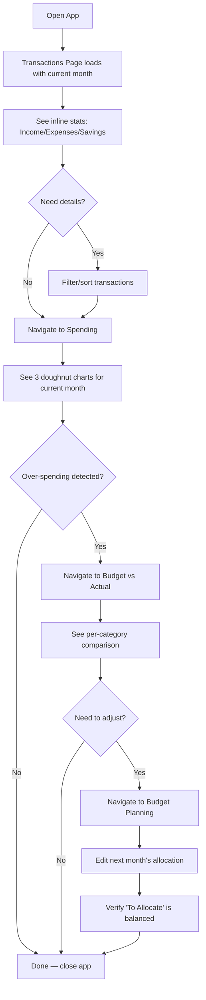
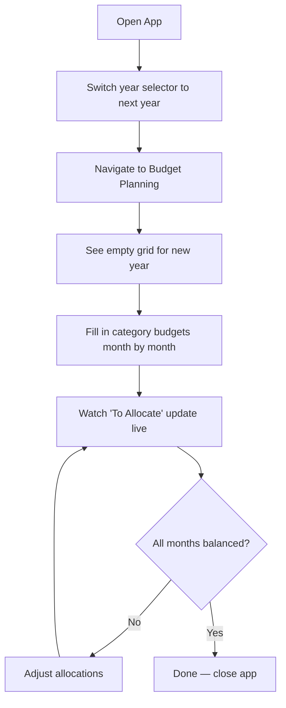
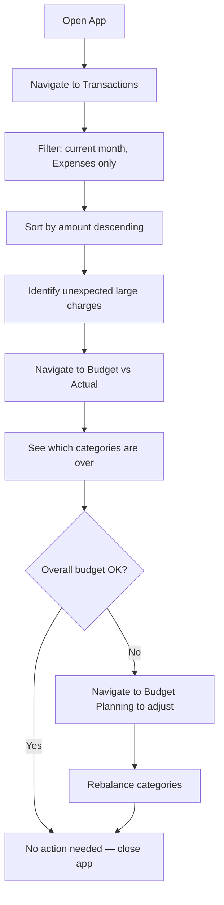

# UX Design Specification life-organizer-frontend

**Author:** Ivo
**Date:** 2026-03-09

---

<!-- UX design content will be appended sequentially through collaborative workflow steps -->

## Executive Summary

### Project Vision

Life-organizer-frontend is a desktop web application that replaces an Excel-based personal budget tracker. It serves as the "read and analyze" layer of a voice-driven personal finance ecosystem — expenses are captured via iOS voice commands, processed by a FastAPI backend, and surfaced here for review, planning, and analysis. The UX goal is to make a weekly financial check-in feel effortless: open the app, see current state, adjust if needed, close in under 3 minutes.

### Target Users

**Primary User: Ivo (Solo User)**
- Tech-savvy expert user comfortable with data-dense interfaces
- Weekly interaction pattern — not a daily dashboard
- Wants rapid answers to specific financial questions ("How much on groceries this month?")
- Accustomed to Excel's information density; expects at least parity in data visibility
- Desktop-only usage on 1280px+ screens

### Key Design Challenges

1. **Budget grid density** — An editable grid of 80+ categories × 12 months must be scannable, navigable, and inline-editable without feeling overwhelming. This is the most complex UI component.
2. **Cross-view coherence** — Four distinct views (Transactions, Spending, Budget, Budget vs Actual) must share consistent visual language, navigation patterns, and filter behavior so the user can context-switch without cognitive overhead.
3. **Global filter awareness** — Year and period selectors control all views. The active filter context must be persistently visible and instantly switchable from any view.

### Design Opportunities

1. **Instant financial awareness** — Smart defaults (current year, current month) and visual summaries (color-coded budget health, spending totals) can answer "how am I doing?" before the user interacts at all.
2. **Information-dense desktop layout** — No mobile constraints allows leveraging wide tables, multi-column layouts, and side-by-side comparisons that match the data consumption patterns of financial analysis.
3. **Progressive disclosure** — Surface summary-level insights (totals, percentages, over/under indicators) prominently; let detailed drill-down (individual transactions, per-cell editing) be available on demand.

## Core Experience Definition

### Core User Action

**The defining interaction:** Open the app → see financial state → close in under 3 minutes. This is not a tool for daily engagement; it's a weekly check-in where speed-to-insight is everything.

### Experience Principles

1. **Immediate Clarity** — Every view answers its primary question without requiring interaction. Transactions page shows totals. Spending page shows the doughnut. Budget page shows allocation status. Budget vs Actual shows over/under.
2. **Dense but Calm** — Information density comparable to Excel, but with visual hierarchy that guides the eye. No blank chrome. No wasted space. But also no visual noise — warm colors, subtle borders, generous use of typographic weight to create hierarchy.
3. **Filter Once, See Everywhere** — Year and period selection persists across all views. Change the month in one view, every view reflects it. No redundant filter configuration.
4. **Edit in Place** — The only write operation (budget planning) happens inline in the grid. No modal forms. No separate edit screens. Click a cell, type a number, move on.
5. **Trust the Data** — Zero-entry workflow means data arrives automatically from iOS voice capture. The UI must inspire confidence that what's shown is current and complete. Last-updated timestamps and clear loading states reinforce trust.

### Critical Success Moments

| Moment | Target Experience |
|--------|-------------------|
| Opening the app after a week | Immediately see current month's income/expenses/savings summary |
| "How much on groceries?" | Filter transactions by category, see total in < 10 seconds |
| "Am I over budget?" | Budget vs Actual view shows per-category status at a glance |
| Editing next month's budget | Click cell → type → tab to next → totals update live |
| Year-end planning | Switch to next year → see empty grid → fill in systematically |

### Platform Experience

- **Desktop-only (1280px+):** Wide tables, multi-column layouts, sidebar navigation always visible
- **Keyboard-friendly:** Tab through budget grid cells, Enter to confirm, Escape to cancel
- **No onboarding needed:** Single expert user — zero learning curve expected

## Desired Emotional Response

### Primary Emotional Goals

| Emotion | Description | Design Implication |
|---------|-------------|-------------------|
| **Control** | "I know exactly where my money goes" | Clear totals, complete transaction history, no hidden data |
| **Calm confidence** | "Everything is under control" | Warm color palette, no red/green panic colors, balanced indicators |
| **Efficiency** | "This took 3 minutes, not 30" | Fast navigation, smart defaults, no unnecessary clicks |
| **Satisfaction** | "This is better than the spreadsheet" | Richer visualization, cleaner layout, auto-populated data |

### Emotional Journey Map

```
Open App → [Curiosity: "What happened this week?"]
  → See summary cards → [Reassurance: "Income is on track"]
  → Check spending breakdown → [Awareness: "Dining is high"]
  → Look at budget vs actual → [Calm: "Overall I'm fine"]
  → Adjust next month's budget → [Control: "I've got this"]
  → Close app → [Satisfaction: "That was quick"]
```

### Design Implications

- **Never alarming:** Over-budget is shown in warm terracotta, not aggressive red. Under-budget is sage green, not neon. The palette communicates information without triggering anxiety.
- **Warm over clinical:** Charcoal with warm undertones, sage and copper accents, serif display typography. This is a personal tool, not a corporate dashboard.
- **Earned density:** Dense data layouts feel satisfying to power users. The density itself communicates "this is a serious tool" — which builds trust.

## UX Pattern Analysis & Inspiration

### Inspiring Products

| Product | What to Borrow | What to Avoid |
|---------|---------------|---------------|
| **Notion** | Clean sidebar navigation, page-as-content model, keyboard shortcuts | Over-flexibility, blank-canvas paralysis |
| **Linear** | Dense tables with excellent scannability, filter bar patterns | Task-oriented metaphors (we're not tracking tasks) |
| **Stripe Dashboard** | Financial data presentation, number formatting, subtle chart integration | Multi-user complexity, notification patterns |
| **Airtable** | Editable grid UX, inline cell editing, column/row structure | Record-detail modals, too many view options |
| **PocketSmith** | Personal finance visualization, category-based spending charts | Cluttered dashboards, too many widgets |

### Transferable Patterns

1. **Linear-style dense tables** — Compact rows, monospace numbers, hover highlights, minimal chrome
2. **Stripe-style financial formatting** — Right-aligned amounts, consistent decimal places, currency prefix
3. **Airtable-style inline editing** — Click to edit, Tab to move, Escape to cancel, auto-save
4. **Notion-style sidebar** — Fixed sidebar with section labels, active state indicator, clean navigation

### Anti-Patterns to Avoid

- **Widget dashboards** — No drag-and-drop widget grids. Each view has a fixed, purposeful layout.
- **Modal-heavy workflows** — No modals for editing budget cells or filtering. Everything inline.
- **Color overload** — Maximum 3 semantic colors (income/expense/savings) + 1 accent. No rainbow charts.
- **Tiny text for density** — Minimum 11px for table data, 13px for body text. Density through spacing, not illegibility.

## Design System

### Selected: Quiet Ledger

**Design Direction:** "Quiet Ledger" — inspired by high-end accounting ledgers and architectural drawings. Warm stone and amber tones against deep charcoal, with copper accents that feel like embossed foil on a leather-bound journal.

**Visual Assets:**
- Color system & component previews: `_bmad-output/ux-color-themes.html`
- Layout direction comparisons: `_bmad-output/ux-design-directions.html`

### Color System

**Surfaces (Dark Mode Primary):**

| Token | Hex | Usage |
|-------|-----|-------|
| `--bg-root` | `#111010` | Page background |
| `--bg-surface` | `#1a1816` | Sidebar, cards |
| `--bg-raised` | `#222019` | Elevated elements |
| `--bg-elevated` | `#2a2822` | Dropdowns, popovers |
| `--bg-hover` | `#33302a` | Row/cell hover |
| `--bg-active` | `#3d3a33` | Active/pressed |

**Semantic Colors:**

| Category | Primary (300) | Dark (600) | Background | Border |
|----------|--------------|------------|------------|--------|
| Income | `#6daa7c` sage | `#2e613e` | `rgba(109,170,124,0.08)` | `rgba(109,170,124,0.25)` |
| Expenses | `#d47b6e` terracotta | `#863e33` | `rgba(212,123,110,0.08)` | `rgba(212,123,110,0.25)` |
| Savings | `#e4a83a` copper | `#9a6318` | `rgba(224,168,58,0.08)` | `rgba(224,168,58,0.25)` |
| Accent | `#9488c0` lavender | `#7a6eaa` | `rgba(148,136,192,0.08)` | `rgba(148,136,192,0.25)` |

**Text:**

| Token | Hex | Usage |
|-------|-----|-------|
| `--text-primary` | `#e8e2d6` | Headings, emphasis, data values |
| `--text-secondary` | `#a69f8f` | Body text, table cells |
| `--text-tertiary` | `#7a7368` | Labels, captions, metadata |

### Typography

| Role | Font | Size | Weight | Usage |
|------|------|------|--------|-------|
| Display | Instrument Serif | 32–48px | 400 | Page titles, hero headings |
| Heading | DM Sans | 24px | 600 | Section headings |
| Subheading | DM Sans | 16px | 600 | Card titles, group headers |
| Body | DM Sans | 14px | 400 | Descriptions, longer text |
| Table data | DM Sans | 12–13px | 400–500 | Table cells, list items |
| Numbers | DM Mono | 12–24px | 400–500 | All monetary amounts, dates |
| Labels | DM Sans | 11px | 600 | Uppercase labels, column headers |

### Layout Direction: Journal (Direction B)

**Selected layout** from the 3 evaluated directions:

| Direction | Sidebar | Density | Best For |
|-----------|---------|---------|----------|
| A: Command Center | 52px icons | Maximum | Budget grid |
| **B: Journal** | **240px with stats** | **Generous** | **All views** |
| C: Hybrid | 180px collapsible | Medium | Versatile |

**Rationale:** Direction B (Journal) was selected for its editorial quality and breathing room:
- **240px sidebar** with labeled navigation and inline quick-stats — always shows monthly summary (income/expenses/savings/remaining) without navigating away
- **Instrument Serif page titles** as hero elements give each view a distinct identity and editorial authority
- **Card-based content sections** with headers and metadata provide clear visual grouping
- **Top-border stat cards** with color coding (income sage, expenses terracotta, savings copper) for summary KPIs
- **12px row padding** on tables provides scannability without sacrificing density

The budget planning grid view uses a narrower sidebar variant (icon-only 52px) to maximize horizontal space for the 12-month grid. All other views use the full 240px sidebar.

## Core Experience — Detailed

### View 1: Transactions (FR1–FR7)

**Primary question:** "What has happened with my money?"

**Layout (Journal):**
```
┌──────────────────────────────────────────────────────────────────────────┐
│ [Sidebar 240px]          │  Transactions                               │
│                          │  47 entries · 6 categories    [2026] [March] [All Types] │
│  ● Life Organizer        │                                              │
│  ─────────────────       │  ┌──────────┐ ┌──────────┐ ┌──────────┐     │
│  ☰ Transactions ◄active  │  │ Income   │ │ Expenses │ │ Savings  │     │
│  ◎ Spending              │  │ €4,250   │ │ €2,847   │ │ €850     │     │
│  ▦ Budget                │  │ on track │ │ +8% vs   │ │ 85% of   │     │
│  ◧ Budget vs Actual      │  └──────────┘ └──────────┘ └──────────┘     │
│                          │                                              │
│  ─────────────────       │  ┌─ Recent Transactions ──── Showing 6 of 47 ┐ │
│  MARCH AT A GLANCE       │  │ Date    Type     Category    Details   Amount │ │
│  Income      €4,250      │  │ Mar 08  Expense  Groceries   Weekly   −€67   │ │
│  Spent       €2,847      │  │ Mar 07  Expense  Dining      Dinner   −€42   │ │
│  Saved       €850        │  │ Mar 05  Income   Salary      Monthly  €4,250 │ │
│  ─────────────           │  │ Mar 04  Savings  Emergency   Auto     €500   │ │
│  Remaining   €553        │  │ ...                                          │ │
│                          │  └────────────────────────────────────────────┘  │
└──────────────────────────────────────────────────────────────────────────┘
```

**Interactions:**
- Click column header to sort (date default, toggle amount)
- Filter pills (year, month, type) next to Instrument Serif page title
- Content wrapped in card with header ("Recent Transactions") and metadata ("Showing 6 of 47")
- Pagination at bottom of card (50 items per page)
- Sidebar quick-stats always show current month summary
- Amounts: right-aligned, monospace, color-coded by type

### View 2: Spending (FR8–FR12)

**Primary question:** "Where is my money going?"

**Layout (Journal):**
```
┌──────────────────────────────────────────────────────────────────────────┐
│ [Sidebar 240px]          │  Category Spending                          │
│                          │  March 2026                  [2026] [March] │
│  ● Life Organizer        │                                              │
│  ─────────────────       │  ┌─ Income ──────────────────────────────────┐ │
│  ☰ Transactions          │  │  [Doughnut]  ● Salary     €4,250   100% │ │
│  ◎ Spending ◄active      │  │   €4,250                                │ │
│  ▦ Budget                │  └───────────────────────────────────────────┘ │
│  ◧ Budget vs Actual      │                                              │
│                          │  ┌─ Expenses ────────────────────────────────┐ │
│  ─────────────────       │  │  [Doughnut]  ● Rent       €995     35%  │ │
│  MARCH AT A GLANCE       │  │   €2,847     ● Groceries  €796     28%  │ │
│  Income      €4,250      │  │              ● Transport  €427     15%  │ │
│  Spent       €2,847      │  │              ● Dining     €341     12%  │ │
│  Saved       €850        │  │              ● Subs       €288     10%  │ │
│  ─────────────           │  └───────────────────────────────────────────┘ │
│  Remaining   €553        │                                              │
│                          │  ┌─ Savings ─────────────────────────────────┐ │
│                          │  │  [Doughnut]  ● Emergency  €500     59%  │ │
│                          │  │   €850       ● Travel     €350     41%  │ │
│                          │  └───────────────────────────────────────────┘ │
└──────────────────────────────────────────────────────────────────────────┘
```

**Interactions:**
- 3 doughnut charts side-by-side (Income, Expenses, Savings)
- Hover on segment highlights category and shows tooltip with amount + percentage
- Center of doughnut shows total for that type
- Legend below/beside each chart with category name, amount, percentage
- Period selector controls all 3 charts simultaneously

### View 3: Budget Planning (FR13–FR19)

**Primary question:** "How should I allocate my money?"

**Layout (Journal — sidebar collapsed for grid width):**
```
┌──────────────────────────────────────────────────────────────────────────┐
│ [52px] │  Budget Planning                                               │
│        │  2026                                            [2026]        │
│  L     │                                                                │
│  ☰     │  ┌─ Budget Grid ───────────────────────────────────────────────┐ │
│  ◎     │  │ Category    │ Jan   │ Feb   │ Mar   │ ... │ Dec   │ Total  │ │
│  ▦◄    │  │─────────────┼───────┼───────┼───────┼─────┼───────┼────────│ │
│  ◧     │  │ INCOME      │       │       │       │     │       │        │ │
│        │  │ Salary      │ 4,250 │ 4,250 │ 4,250 │ ... │ 4,250 │ 51,000 │ │
│        │  │ Freelance   │   500 │   —   │   300 │ ... │   —   │  1,300 │ │
│        │  │ Total Inc   │ 4,750 │ 4,250 │ 4,550 │ ... │ 4,250 │ 52,300 │ │
│        │  │─────────────┼───────┼───────┼───────┼─────┼───────┼────────│ │
│        │  │ EXPENSES    │       │       │       │     │       │        │ │
│        │  │ ...         │       │       │       │     │       │        │ │
│        │  │═════════════╪═══════╪═══════╪═══════╪═════╪═══════╪════════│ │
│        │  │ To Allocate │ 1,899 │ 1,299 │ 1,499 │ ... │ 1,249 │  9,194 │ │
│        │  └─────────────────────────────────────────────────────────────┘ │
└──────────────────────────────────────────────────────────────────────────┘
```

**Interactions:**
- **Sidebar auto-collapses** to 52px icon-only mode to maximize grid width
- Click any cell to enter edit mode (input replaces display value)
- Tab moves to next cell (right), Shift+Tab moves left
- Enter confirms and moves down, Escape cancels
- Row totals and column totals update live on each edit
- "To Allocate" row: green when positive, red when negative, dim when zero
- Section headers (INCOME/EXPENSES/SAVINGS) are color-coded and collapsible
- First column (category names) is sticky — stays visible during horizontal scroll

### View 4: Budget vs Actual (FR20–FR24)

**Primary question:** "Am I on track?"

**Layout (Journal):**
```
┌──────────────────────────────────────────────────────────────────────────┐
│ [Sidebar 240px]          │  Budget vs Actual                            │
│                          │  March 2026                  [2026] [March]  │
│  ● Life Organizer        │                                              │
│  ─────────────────       │  ┌─ Expenses ────────────────────────────────┐ │
│  ☰ Transactions          │  │ Category     Budget  Actual  [Bar]  % Rem │ │
│  ◎ Spending              │  │ Groceries    €700    €796    ████▓ 114 −96 │ │
│  ▦ Budget                │  │ Dining Out   €300    €341    ████▓ 114 −41 │ │
│  ◧ vs Actual ◄active     │  │ Rent         €995    €995    ████  100   0 │ │
│                          │  │ Transport    €356    €356    ████  100   0 │ │
│  ─────────────────       │  │ Subs         €350    €288    ███    82  62 │ │
│  MARCH AT A GLANCE       │  │ Entertain.   €200    €85     ██     42 115 │ │
│  Income      €4,250      │  └───────────────────────────────────────────┘ │
│  Spent       €2,847      │                                              │
│  Saved       €850        │  ┌─ Income ──────────────────────────────────┐ │
│  ─────────────           │  │ Salary       €4,250  €4,250  ████  100  0 │ │
│  Remaining   €553        │  └───────────────────────────────────────────┘ │
│                          │                                              │
│                          │  ┌─ Savings ─────────────────────────────────┐ │
│                          │  │ Emergency    €500    €500    ████  100  0 │ │
│                          │  │ Travel       €350    €350    ████  100  0 │ │
│                          │  └───────────────────────────────────────────┘ │
└──────────────────────────────────────────────────────────────────────────┘
```

**Interactions:**
- Sorted by overspend first (worst offenders at top)
- Progress bar color: sage green (< 80%), amber (80–100%), terracotta (> 100%)
- Remaining column: positive in green, negative in terracotta
- Tabs switch between Expenses (default), Income, Savings sections
- Click a category row to expand and show contributing transactions (progressive disclosure)

## User Journey Flows

### Journey 1: Weekly Financial Check-in



### Journey 2: Year-End Budget Planning



### Journey 3: Investigating a Spending Surprise



## Component Strategy

### Component Priority (by user journey criticality)

| Priority | Component | Views Used | Complexity |
|----------|-----------|------------|------------|
| P0 | Transaction Table | Transactions | Medium — sortable, paginated |
| P0 | Budget Grid | Budget Planning | High — inline editable, live totals |
| P0 | Doughnut Chart | Spending | Medium — Recharts wrapper |
| P0 | App Layout (sidebar + header) | All | Medium — collapsible sidebar |
| P0 | Filter Bar | All | Low — year/period selectors |
| P1 | Budget Comparison Table | Budget vs Actual | Medium — progress bars |
| P1 | Summary Stats (inline) | Transactions, Budget vs Actual | Low |
| P1 | Type Badges | Transactions, Budget vs Actual | Low |
| P2 | Pagination | Transactions | Low |
| P2 | Chart Legend | Spending | Low |
| P2 | Allocation Indicator | Budget Planning | Low |
| P2 | Empty State | All | Low |
| P2 | Error State | All | Low |
| P2 | Loading Skeleton | All | Low |

### Custom Component Specifications

**Budget Grid Cell** — The most complex atomic component:
- **States:** Display (monospace number), Edit (input field), Empty (dash), Hover (subtle outline)
- **Transitions:** Click → Edit, Tab → next cell, Enter → confirm + move down, Escape → cancel
- **Styling:** Right-aligned, `DM Mono`, 12px. Edit state has subtle border glow in `--income-border`

**Allocation Indicator Row** — Bottom row of budget grid:
- **States:** Positive (sage green), Zero (dim gray), Negative (terracotta)
- **Calculation:** Income total - Expenses total - Savings total per column
- **Weight:** Bold, slightly larger than data cells

**Progress Bar** — Budget vs Actual completion:
- **Segments:** Under 80% (sage), 80–100% (amber), Over 100% (terracotta, capped at visual 100% but shows actual %)
- **Height:** 6px, rounded corners, subtle background track

## UX Consistency Patterns

### Navigation Pattern

- **Sidebar:** Always visible, 240px with labeled nav items + monthly quick-stats at bottom. Collapses to 52px icon-only on Budget Planning grid.
- **Active state:** Copper background tint + copper text + 1px copper border
- **Page hero:** Instrument Serif page title (32px) at top of content area with filter pills alongside (year, period)

### Data Display Pattern

- **Tables:** Left-aligned text, right-aligned numbers. Monospace for all amounts. Subtle row borders. Hover highlight.
- **Numbers:** Always show currency prefix (€). Two decimal places for amounts. Comma-separated thousands.
- **Negative amounts:** Prefixed with minus sign (−€). Terracotta color.
- **Positive amounts:** No prefix. Sage color for income, copper for savings.

### Feedback Pattern

- **Loading:** Skeleton loaders matching content shape (table rows, chart circles, grid cells)
- **Error:** Full-width error banner with retry button. Warm yellow background, not red.
- **Empty:** Centered message with subtle illustration. "No transactions for this period."
- **Save success:** Brief toast notification for budget saves. Auto-dismiss after 3 seconds.
- **Save failure:** Persistent toast with retry button. Terracotta accent.

### Interaction Pattern

- **Click:** Standard click for navigation, sorting, cell editing
- **Hover:** Row highlight on tables, cell outline on budget grid
- **Keyboard:** Tab through budget cells, Enter to confirm, Escape to cancel
- **Transitions:** 150ms ease for hover states, 200ms for panel transitions, 300ms for chart animations

### Filter Pattern

- **Year selector:** Dropdown, current year pre-selected
- **Period selector:** Dropdown with "Total Year" + 12 month options, current month pre-selected
- **Type filter (Transactions):** Tab bar (All | Income | Expenses | Savings)
- **Category filter (Transactions):** Dropdown multi-select
- **Persistence:** Filters persist during session across view navigation

## Responsive & Accessibility

### Responsive Strategy

**Desktop-only (1280px+)**. No tablet or mobile breakpoints.

| Viewport | Behavior |
|----------|----------|
| 1280–1440px | Sidebar 240px, content fills remaining width |
| 1440–1920px | Content area caps at 1200px max-width with centered layout OR fills width for budget grid |
| 1920px+ | Content centered with generous side margins |

**Budget Grid Exception:** The budget planning grid fills 100% available width regardless of viewport. Sidebar collapses to 52px. Horizontal scroll enabled for category column + 12 month columns + total column if needed.

### Accessibility

| Concern | Implementation |
|---------|----------------|
| Keyboard navigation | Tab through interactive elements, Enter/Escape for edit mode, Arrow keys in budget grid |
| Focus indicators | 2px outline in `--accent-400` on focus, visible against dark background |
| Color contrast | All text meets WCAG AA against dark backgrounds (4.5:1 ratio minimum) |
| Semantic HTML | `<table>` for data tables, `<nav>` for sidebar, `<main>` for content, proper heading hierarchy |
| ARIA labels | Chart segments labeled, budget grid cells have row/column context |
| Screen reader | Not a primary concern (single sighted user) but semantic HTML provides baseline support |

## Completion & Handoff

### Deliverables Summary

| Deliverable | Location |
|-------------|----------|
| UX Design Specification | `_bmad-output/ux-design-specification.md` (this document) |
| Color System & Component Preview | `_bmad-output/ux-color-themes.html` |
| Layout Direction Comparison | `_bmad-output/ux-design-directions.html` |

### Design System: Quiet Ledger — Quick Reference

- **Primary palette:** Warm charcoal surfaces, sage income, terracotta expenses, copper savings
- **Typography:** Instrument Serif (display), DM Sans (body), DM Mono (numbers)
- **Layout:** Journal direction — 240px sidebar with quick-stats, Instrument Serif hero titles, card-based sections
- **Components:** shadcn/ui primitives + custom budget grid, doughnut chart wrapper, progress bar

### Recommended Next Steps

1. **Create Epics & Stories** — Break the PRD + Architecture + UX spec into implementable stories
2. **Scaffold project** — Initialize with `npx shadcn@latest init --template vite`, configure Tailwind theme with Quiet Ledger tokens
3. **Implement layout shell first** — Sidebar, filter bar, routing — validate the spatial model before building features
4. **Budget grid prototype** — The highest-complexity component; prototype the inline editing early to validate the UX
